# Panduan Pengguna Aplikasi Penilaian Kinerja Guru PJOK SD KBB

Dokumen ini menjelaskan cara menggunakan aplikasi Penilaian Kinerja Guru PJOK SD Kabupaten Bandung Barat untuk empat role utama:

- Admin
- Pengawas
- Kepala Sekolah
- Guru

Panduan ini menggunakan contoh tampilan dari environment DEV online. Menu yang muncul dapat berbeda sesuai role dan hak akses pengguna.

## 1. Akses Aplikasi

1. Buka URL aplikasi.
2. Masukkan email dan kata sandi yang diberikan oleh Admin.
3. Klik **Masuk**.
4. Setelah berhasil login, pengguna diarahkan ke **Dashboard** sesuai role.

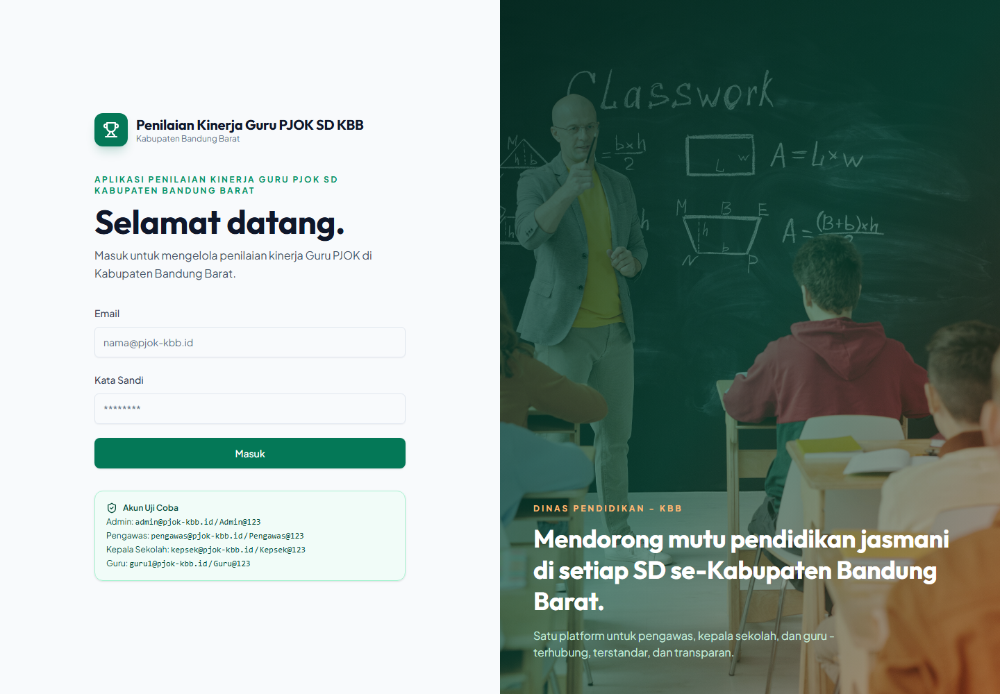

Catatan keamanan:

- Jangan membagikan email dan kata sandi kepada pengguna lain.
- Jika akun tidak bisa login, hubungi Admin untuk mengecek status akun.
- Setelah selesai menggunakan aplikasi, klik menu profil di kanan atas lalu pilih **Keluar**.

## 2. Ringkasan Role dan Hak Akses

| Role | Fungsi Utama |
| --- | --- |
| Admin | Mengelola master data, periode, instrumen, assignment, Evaluasi & RTL, report, audit log, dan hak akses. |
| Pengawas | Melakukan penilaian untuk assignment yang ditugaskan kepadanya, mengisi skor, memproses feedback guru, mengisi RTL, dan melihat report sesuai akses. |
| Kepala Sekolah | Melakukan penilaian untuk assignment yang ditugaskan kepadanya, melihat guru di sekolahnya, memproses feedback, mengisi RTL untuk assignment miliknya, dan melihat report sesuai akses. |
| Guru | Melihat assignment miliknya, mereview hasil penilaian, memberi feedback maksimal 2 kali, mengusulkan aspek observasi, dan melihat report miliknya. |

## 3. Panduan Admin

### 3.1 Dashboard Admin

Dashboard Admin menampilkan ringkasan kondisi penilaian, termasuk jumlah data utama, assignment, status workflow, dan ringkasan penilaian.

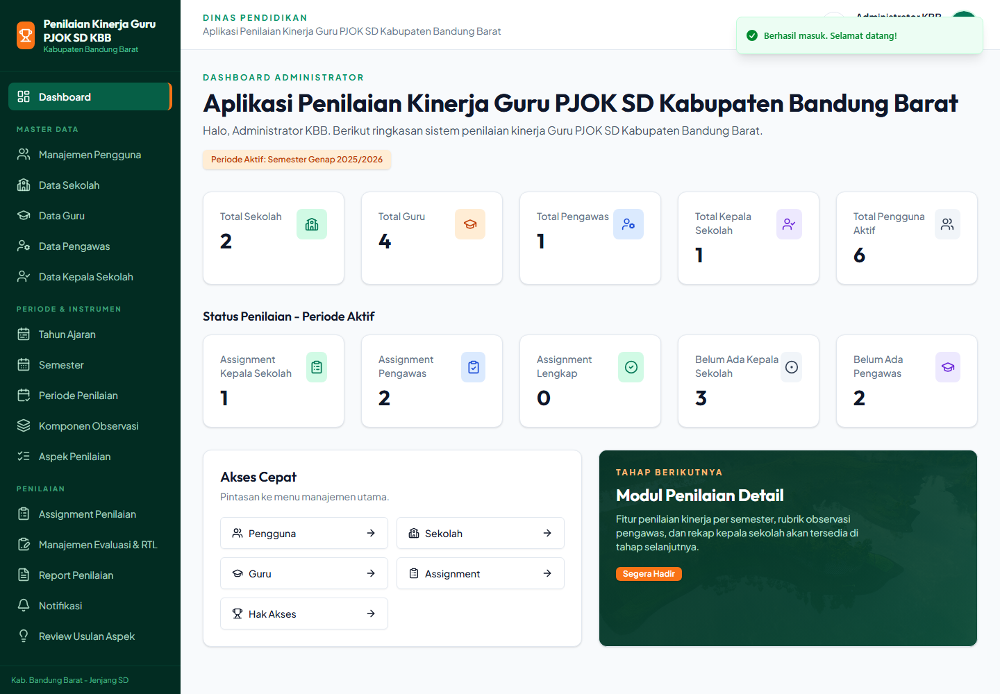

Yang perlu dicek Admin dari dashboard:

1. Pastikan periode aktif sudah tersedia.
2. Pantau jumlah assignment Kepala Sekolah dan Pengawas.
3. Pantau guru yang assignment-nya belum lengkap.
4. Pantau status Draft, Final, dan progress penilaian.

### 3.2 Manajemen Pengguna

Menu **Manajemen Pengguna** digunakan untuk mengelola akun login aplikasi.

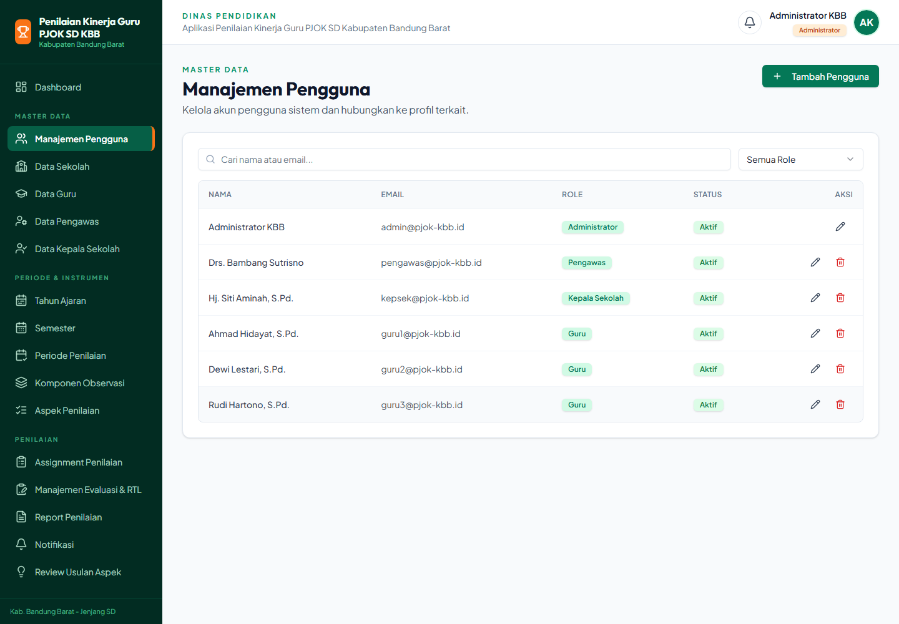

Langkah umum:

1. Buka menu **Manajemen Pengguna**.
2. Tambahkan akun sesuai role: Admin, Pengawas, Kepala Sekolah, atau Guru.
3. Pastikan email unik dan status akun aktif.
4. Hubungkan akun dengan profil terkait jika diperlukan, misalnya Guru dengan data guru.
5. Simpan perubahan.

Tips:

- Nonaktifkan akun yang sudah tidak digunakan.
- Jangan membuat akun ganda untuk orang yang sama.
- Pastikan role sesuai tugas pengguna.

### 3.3 Master Data

Admin bertanggung jawab menjaga master data tetap benar sebelum proses penilaian berjalan.

Master data yang dikelola Admin:

- Data Sekolah
- Data Guru
- Data Pengawas
- Data Kepala Sekolah
- Tahun Ajaran
- Semester
- Periode Penilaian
- Komponen Observasi
- Aspek Penilaian

Urutan yang disarankan:

1. Lengkapi data sekolah.
2. Lengkapi data guru dan hubungkan ke sekolah.
3. Lengkapi data kepala sekolah dan hubungkan ke sekolah.
4. Lengkapi data pengawas dan wilayah binaan.
5. Buat tahun ajaran dan semester.
6. Buat periode penilaian dan aktifkan satu periode.
7. Pastikan komponen dan aspek penilaian aktif.

### 3.4 Assignment Penilaian

Menu **Assignment Penilaian** digunakan untuk membuat dan memantau assignment penilaian.

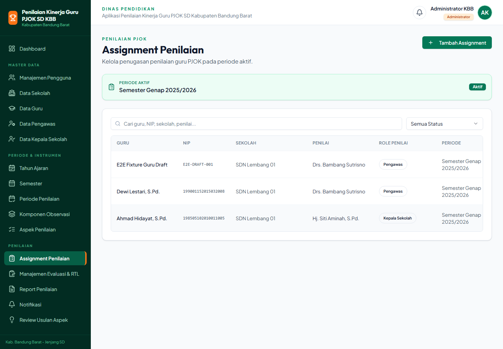

Business rule penting:

- Satu guru dapat memiliki maksimal dua assignment utama pada periode aktif yang sama.
- Satu assignment oleh **Kepala Sekolah**.
- Satu assignment oleh **Pengawas**.
- Sistem menolak duplikat assignment untuk role penilai yang sama pada guru dan periode yang sama.

Langkah membuat assignment:

1. Buka menu **Assignment Penilaian**.
2. Klik **Tambah Assignment**.
3. Pilih guru.
4. Sistem membaca sekolah guru secara otomatis.
5. Sistem mencari Kepala Sekolah sesuai sekolah guru.
6. Sistem mencari Pengawas sesuai wilayah sekolah guru.
7. Pilih jenis assignment yang ingin dibuat:
   - **Penilaian oleh Kepala Sekolah**
   - **Penilaian oleh Pengawas**
   - atau keduanya jika tersedia.
8. Isi tanggal observasi jika sudah ditentukan.
9. Simpan assignment.

Hal yang perlu diperhatikan:

- Jika Kepala Sekolah tidak ditemukan, lengkapi data Kepala Sekolah terlebih dahulu.
- Jika Pengawas tidak ditemukan, cek wilayah sekolah dan data Pengawas.
- Jika Pengawas lebih dari satu, pilih pengawas yang sesuai dari dropdown.

### 3.5 Form Penilaian Detail

Admin dapat membuka form penilaian untuk melihat atau membantu pengecekan data.

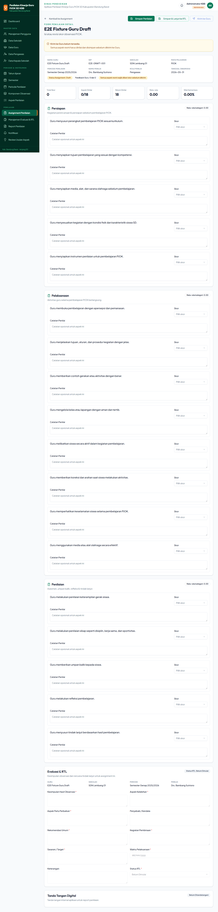

Di form penilaian terdapat:

- Informasi guru
- NIP
- Sekolah
- Mata pelajaran
- Periode penilaian
- Penilai
- Role penilai
- Tanggal observasi
- Status assignment
- Aspek resmi per kategori
- Aspek tambahan atau usulan guru jika sudah approved
- Skor 1 sampai 4
- Catatan penilai
- Kalkulasi nilai sementara
- Evaluasi & RTL
- Tombol workflow sesuai status

Aturan skor:

| Skor | Label |
| --- | --- |
| 1 | Kurang |
| 2 | Cukup |
| 3 | Baik |
| 4 | Sangat Baik |

Catatan:

- Semua aspek resmi wajib diberi skor sebelum penilaian dikirim ke Guru.
- Catatan per aspek bersifat optional.
- Aspek usulan guru tidak masuk nilai utama.

### 3.6 Manajemen Evaluasi & RTL

Menu **Manajemen Evaluasi & RTL** digunakan Admin untuk memantau dan mengelola data Evaluasi dan Rencana Tindak Lanjut.

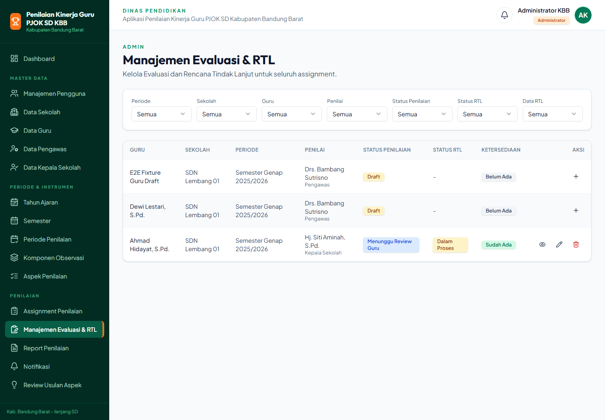

Admin dapat:

1. Melihat assignment yang sudah atau belum memiliki Evaluasi & RTL.
2. Menambah RTL jika assignment belum Final.
3. Mengedit RTL jika assignment belum Final.
4. Menghapus RTL secara soft delete jika assignment belum Final.
5. Memfilter berdasarkan periode, sekolah, guru, penilai, status penilaian, dan status RTL.

Evaluasi & RTL terkunci jika assignment sudah **Final**.

Field Evaluasi:

- Kesimpulan hasil observasi
- Aspek kelebihan
- Aspek yang perlu diperbaiki
- Penyebab kendala
- Rekomendasi umum

Field RTL:

- Kegiatan pembinaan
- Sasaran target
- Waktu pelaksanaan
- Keterangan
- Status RTL

Status RTL:

- Belum Dimulai
- Dalam Proses
- Selesai

### 3.7 Report Penilaian

Menu **Report Penilaian** digunakan untuk melihat rekap hasil penilaian dan export PDF jika eligible.

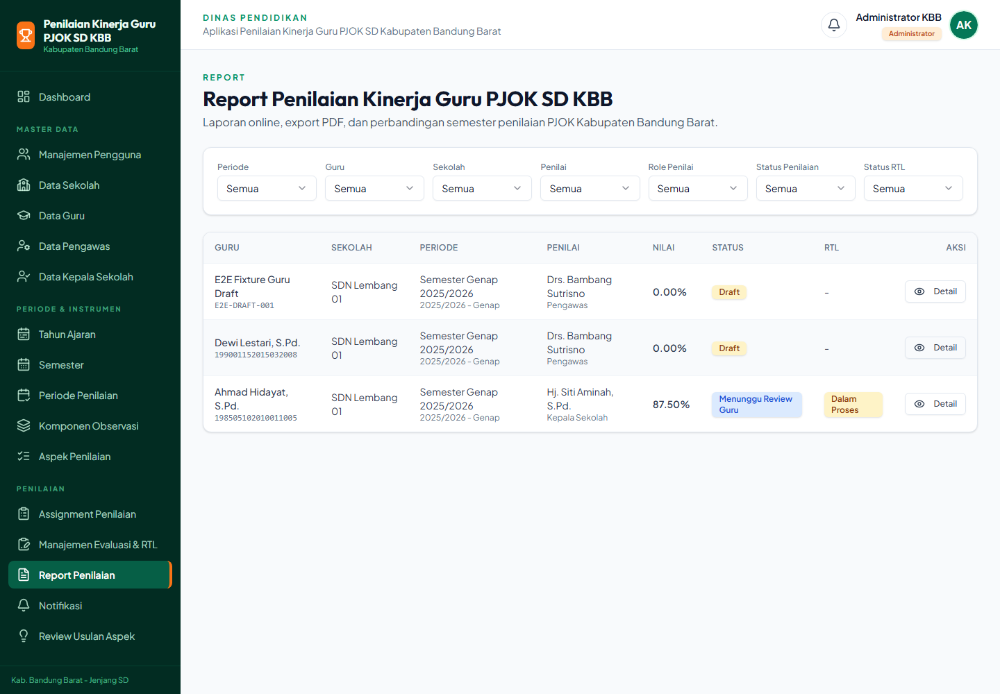

Langkah umum:

1. Buka menu **Report Penilaian**.
2. Gunakan filter jika diperlukan.
3. Klik detail report untuk melihat hasil penilaian.
4. Klik **Export PDF** jika tombol tersedia dan data sudah memenuhi syarat.

### 3.8 Audit Log

Menu **Audit Log** hanya tersedia untuk Admin.

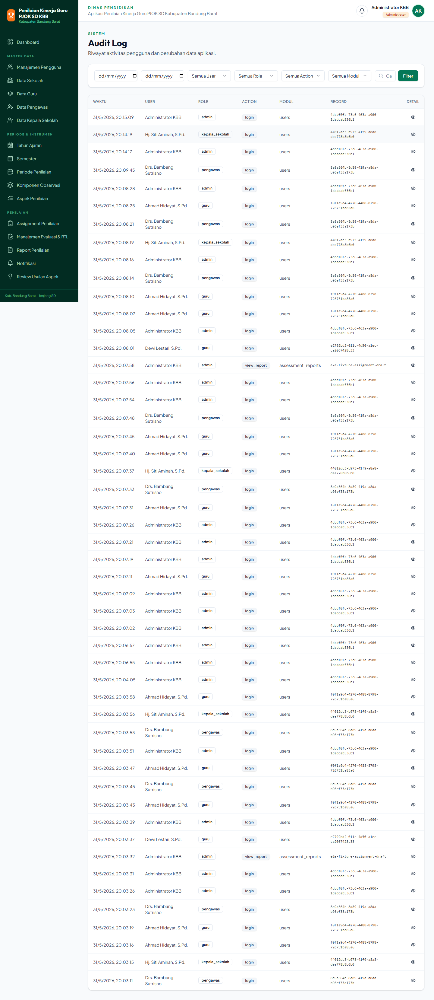

Audit log mencatat aktivitas penting, seperti:

- Login
- Membuat assignment
- Mengubah assignment
- Menyimpan skor
- Mengirim penilaian ke Guru
- Feedback Guru
- Menyimpan Evaluasi & RTL
- Finalisasi
- Export report

Gunakan audit log untuk menelusuri aktivitas jika terjadi masalah data.

## 4. Panduan Pengawas

### 4.1 Dashboard Pengawas

Dashboard Pengawas menampilkan ringkasan assignment dan aktivitas penilaian yang berkaitan dengan akun Pengawas tersebut.

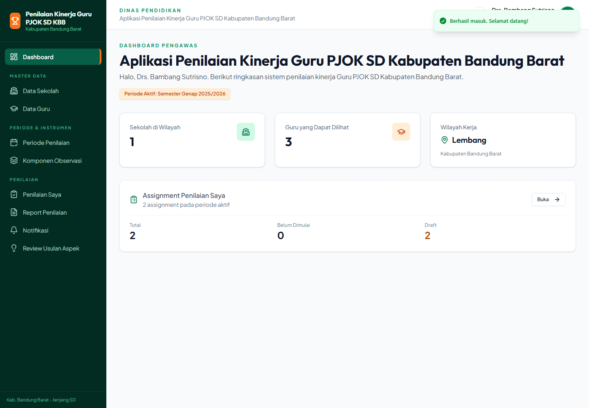

Pengawas hanya dapat mengisi atau memproses assignment yang ditugaskan kepadanya sebagai penilai.

### 4.2 Penilaian Saya

Menu **Penilaian Saya** berisi daftar assignment yang menjadi tanggung jawab Pengawas.

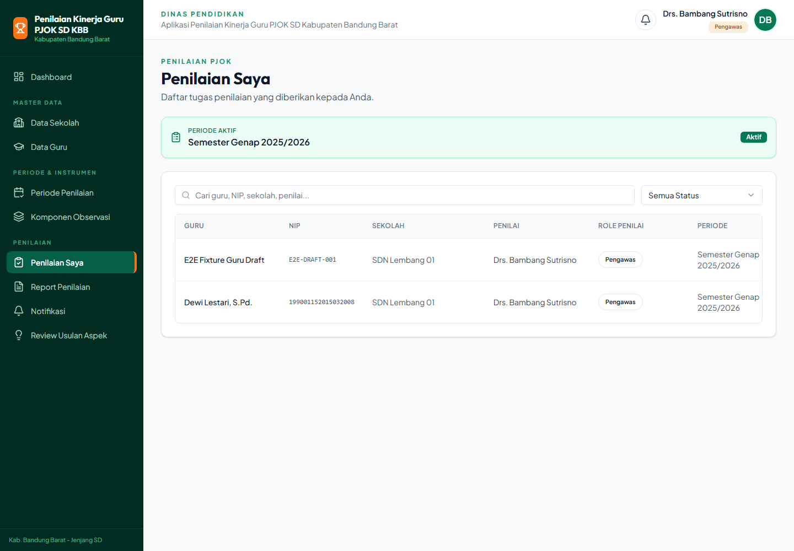

Action yang mungkin tersedia:

- Lihat Detail
- Mulai Penilaian
- Isi Penilaian
- Lanjutkan Penilaian
- Kirim ke Guru
- Kirim Revisi ke Guru
- Lihat Report
- Export PDF jika eligible

Catatan permission:

- Pengawas tidak dapat mengisi assignment milik Kepala Sekolah.
- Pengawas tidak dapat mengisi assignment milik Pengawas lain.
- Jika assignment bukan miliknya, action edit atau isi penilaian tidak ditampilkan.

### 4.3 Mengisi Form Penilaian

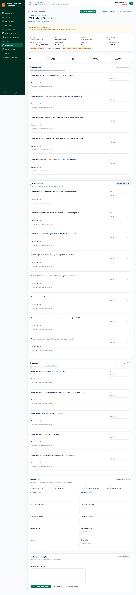

Langkah mengisi penilaian:

1. Buka **Penilaian Saya**.
2. Pilih assignment.
3. Klik **Mulai Penilaian**, **Isi Penilaian**, atau **Lanjutkan Penilaian** sesuai status.
4. Isi skor 1 sampai 4 pada setiap aspek resmi.
5. Isi catatan jika diperlukan.
6. Klik **Simpan Penilaian**.
7. Lengkapi Evaluasi & RTL jika skor resmi sudah lengkap.
8. Klik **Kirim ke Guru** jika semua syarat sudah terpenuhi.

Validasi penting:

- Semua aspek resmi wajib diberi skor sebelum dikirim ke Guru.
- Catatan boleh kosong.
- Assignment Final tidak bisa diedit.
- Saat status **Menunggu Review Guru**, skor tidak bisa diedit sampai Guru memberi feedback.

### 4.4 Memproses Feedback Guru

Jika Guru memberi feedback:

1. Status berubah menjadi **Feedback dari Guru**.
2. Buka assignment terkait.
3. Baca feedback Guru.
4. Klik atau mulai proses revisi jika tersedia.
5. Perbaiki skor atau catatan jika diperlukan.
6. Klik **Kirim Revisi ke Guru**.

Aturan feedback:

- Guru dapat memberi feedback maksimal dua kali.
- Setelah feedback kedua diproses dan syarat finalisasi lengkap, assignment dapat menjadi Final.

### 4.5 Review Usulan Aspek Guru

Menu **Review Usulan Aspek** digunakan untuk menyetujui atau menolak usulan aspek dari guru yang assignment-nya diberikan kepada Pengawas tersebut.

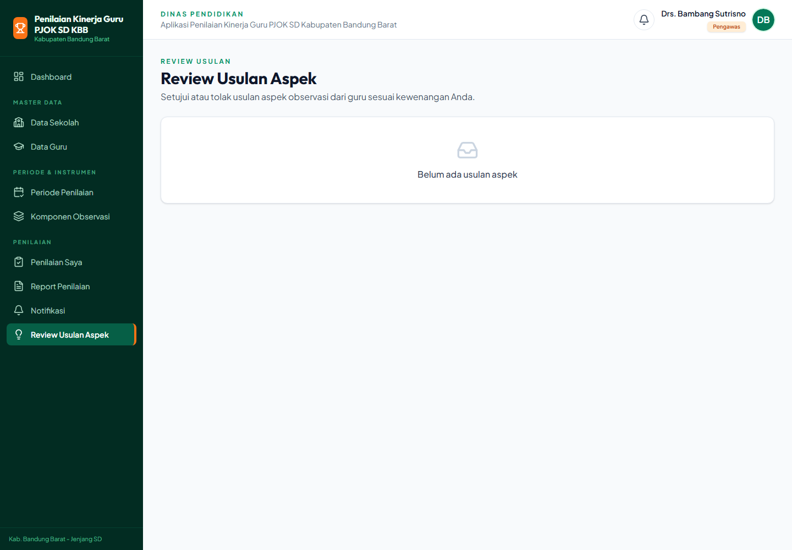

Langkah:

1. Buka **Review Usulan Aspek**.
2. Pilih usulan dengan status **Pending**.
3. Baca nama aspek, kategori, deskripsi, dan alasan.
4. Isi catatan review jika diperlukan.
5. Klik **Approve** atau **Reject**.

Jika approved:

- Aspek muncul di Form Penilaian Detail sebagai **Usulan Guru**.
- Aspek dapat diberi skor dan catatan.
- Skor aspek usulan tidak masuk nilai utama.

### 4.6 Report Pengawas

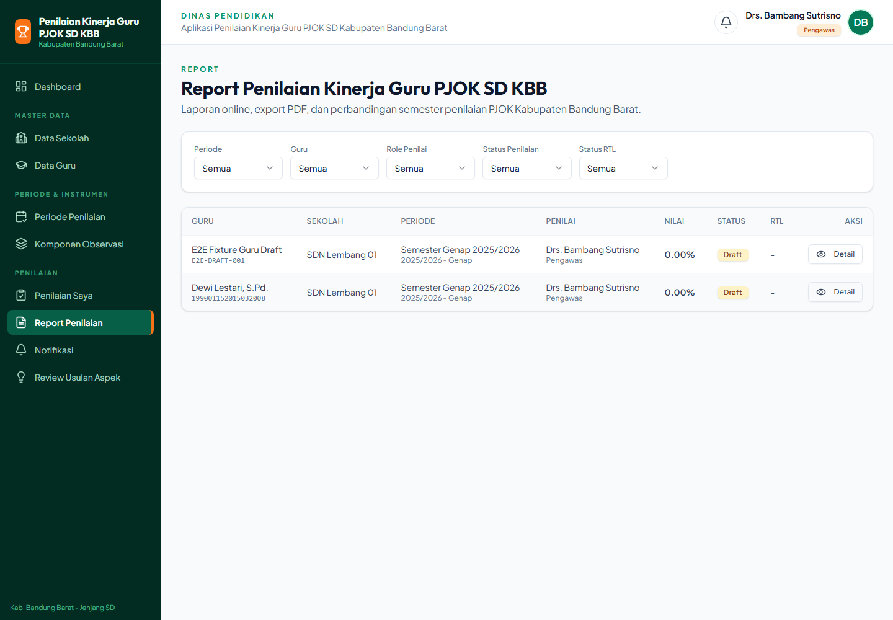

Pengawas dapat melihat report sesuai assignment yang menjadi kewenangannya.

## 5. Panduan Kepala Sekolah

### 5.1 Dashboard Kepala Sekolah

Dashboard Kepala Sekolah menampilkan ringkasan guru dan penilaian di sekolahnya.

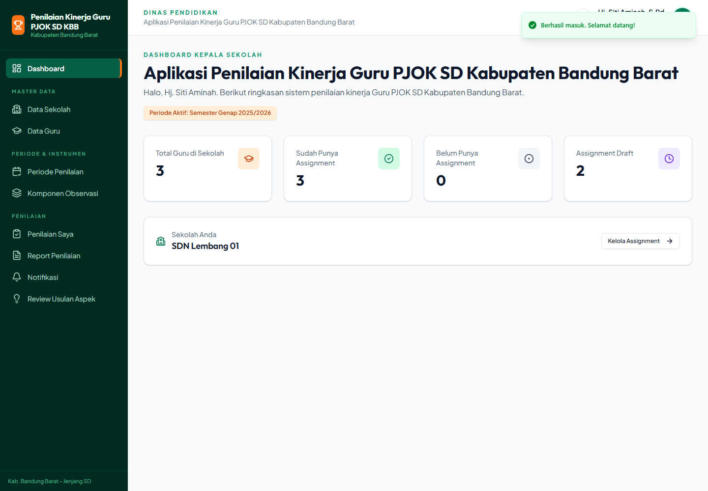

Kepala Sekolah dapat:

- Melihat data guru di sekolahnya.
- Melakukan penilaian jika ditugaskan sebagai assessor.
- Melihat assignment guru di sekolahnya sesuai akses.
- Melihat report sesuai kewenangan.

### 5.2 Penilaian Saya

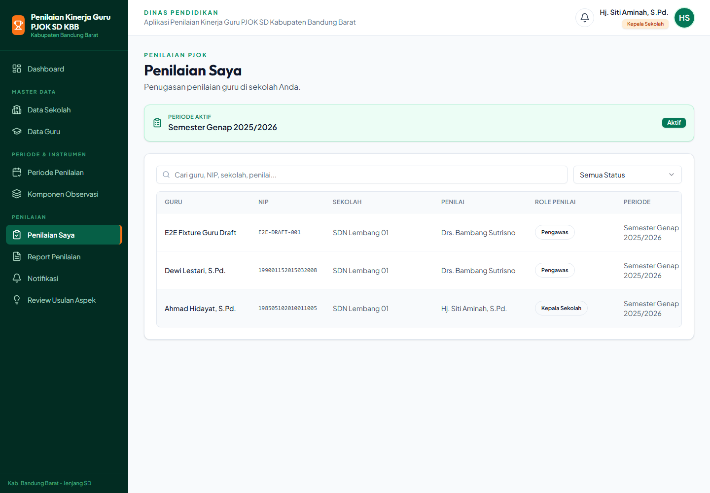

Aturan penting:

- Kepala Sekolah hanya boleh mengisi assignment jika `assessor_user_id` assignment adalah dirinya.
- Jika assignment guru tersebut ditugaskan kepada Pengawas, Kepala Sekolah hanya boleh melihat sesuai akses, bukan mengisi atau mengedit.
- Assignment Final tidak bisa diedit.

Langkah mengisi penilaian:

1. Buka **Penilaian Saya**.
2. Pilih assignment yang memang ditugaskan kepada Kepala Sekolah.
3. Klik **Mulai Penilaian** atau **Isi Penilaian**.
4. Isi skor setiap aspek resmi.
5. Simpan penilaian.
6. Lengkapi Evaluasi & RTL.
7. Kirim ke Guru jika semua syarat terpenuhi.

### 5.3 Review Usulan Aspek

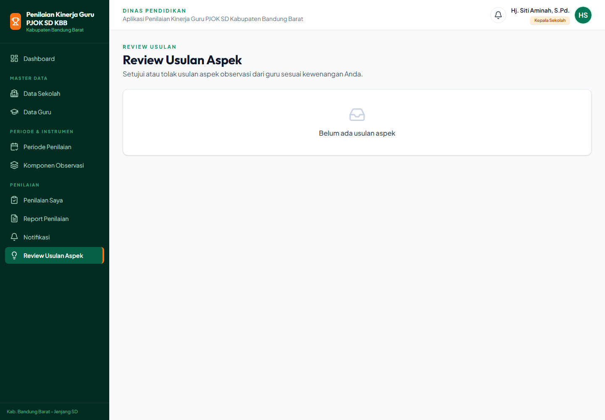

Kepala Sekolah dapat mereview usulan aspek dari guru di sekolahnya sesuai kewenangan.

Langkah:

1. Buka **Review Usulan Aspek**.
2. Baca usulan Guru.
3. Isi catatan review.
4. Approve atau Reject.

### 5.4 Report Kepala Sekolah

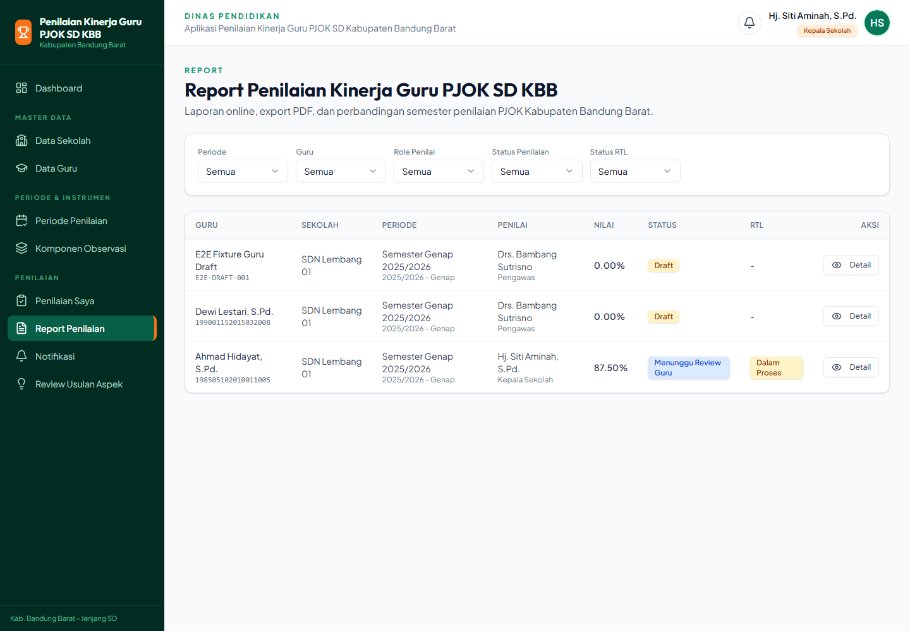

Kepala Sekolah dapat melihat report yang sesuai dengan sekolah dan kewenangannya.

## 6. Panduan Guru

### 6.1 Dashboard Guru

Dashboard Guru menampilkan status penilaian miliknya.

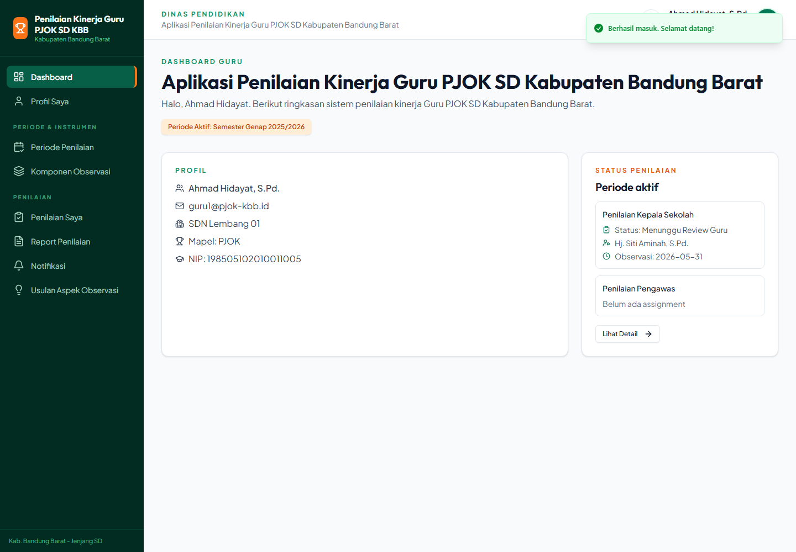

Guru dapat melihat:

- Status Penilaian Kepala Sekolah
- Status Penilaian Pengawas
- Progress review
- Notifikasi
- Akses ke penilaian dan report miliknya

### 6.2 Profil Saya

Menu **Profil Saya** berisi informasi identitas Guru.

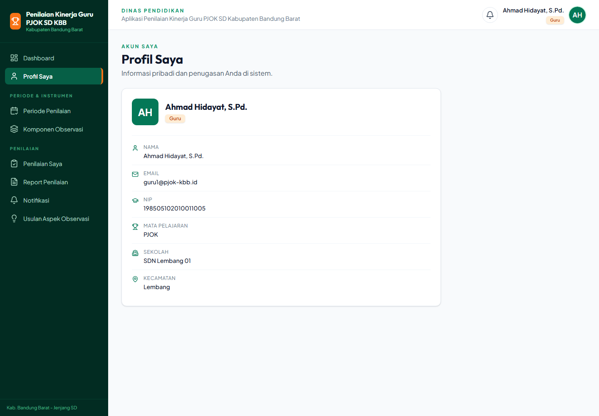

Guru dapat mengecek:

- Nama
- NIP
- Sekolah
- Mata pelajaran
- Data profil lain yang tersedia

Jika data salah, hubungi Admin.

### 6.3 Penilaian Saya

Menu **Penilaian Saya** menampilkan status assignment Guru.

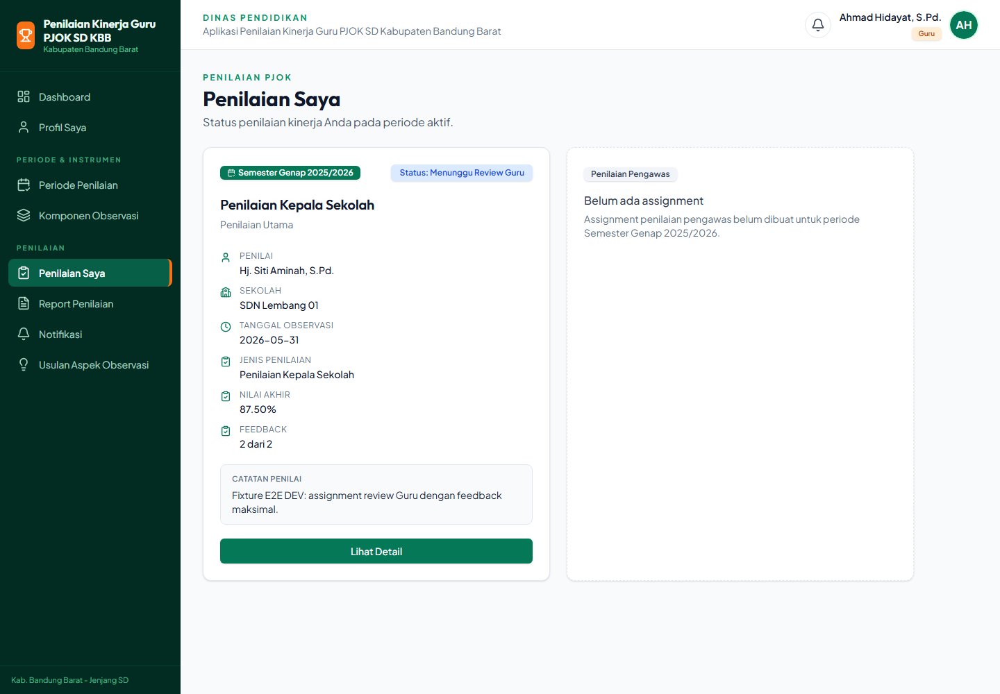

Guru dapat melihat dua status terpisah:

- Penilaian Kepala Sekolah
- Penilaian Pengawas

Tombol **Lihat Detail** muncul jika hasil penilaian sudah tersedia untuk direview atau sudah final.

### 6.4 Review Hasil Penilaian

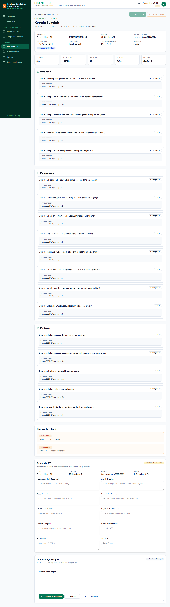

Di halaman detail review, Guru dapat melihat:

- Data Guru
- Periode penilaian
- Nama penilai
- Role penilai
- Skor per aspek
- Catatan per aspek
- Nilai akhir
- Aspek tambahan atau usulan Guru
- Evaluasi & RTL
- Riwayat feedback

Jika status **Menunggu Review Guru**, Guru dapat:

1. Klik **Setujui / OK** jika hasil penilaian sudah sesuai.
2. Klik **Beri Feedback** jika ada catatan yang perlu ditanggapi penilai.

Aturan feedback:

- Guru maksimal memberi feedback dua kali per assignment.
- Setelah status Final, Guru tidak bisa memberi feedback lagi.
- Guru tidak bisa mengubah skor.

### 6.5 Usulan Aspek Observasi

Menu **Usulan Aspek Observasi** digunakan Guru untuk mengusulkan aspek tambahan yang ingin diamati.

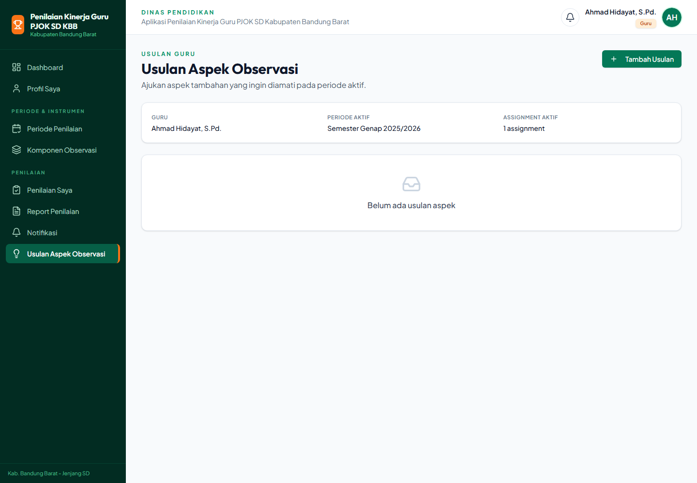

Langkah submit usulan:

1. Buka **Usulan Aspek Observasi**.
2. Pilih kategori:
   - Persiapan
   - Pelaksanaan
   - Penilaian
3. Isi nama aspek.
4. Isi deskripsi aspek.
5. Isi alasan usulan.
6. Simpan usulan.

Status usulan:

| Status | Arti |
| --- | --- |
| Pending | Menunggu review Admin/Pengawas/Kepala Sekolah. |
| Approved | Usulan disetujui dan dapat muncul di form penilaian. |
| Rejected | Usulan ditolak. |
| Cancelled | Usulan dibatalkan oleh Guru sebelum direview. |

Aturan:

- Guru hanya bisa melihat usulan miliknya sendiri.
- Guru boleh edit atau cancel selama status masih Pending.
- Guru tidak bisa edit atau cancel jika status sudah Approved atau Rejected.
- Usulan approved tidak masuk nilai utama, hanya sebagai aspek tambahan.

### 6.6 Report Guru

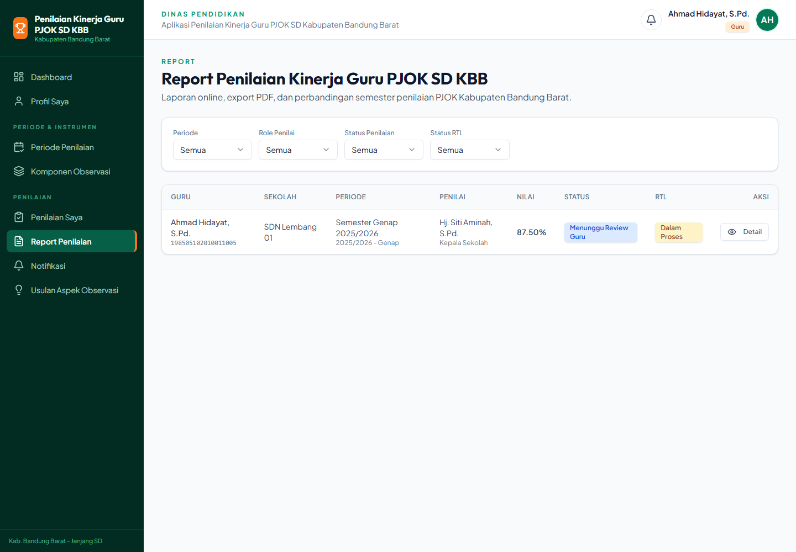

Guru dapat membuka report miliknya sendiri jika report sudah tersedia.

Guru tidak dapat melihat report milik Guru lain.

## 7. Status Workflow Penilaian

| Status | Penjelasan |
| --- | --- |
| Belum Dimulai | Assignment sudah dibuat, tetapi penilaian belum dimulai. |
| Draft | Penilai sedang mengisi atau menyimpan penilaian. |
| Menunggu Review Guru | Penilaian sudah dikirim ke Guru untuk direview. |
| Feedback dari Guru | Guru mengirim feedback dan menunggu penilai memproses revisi. |
| Draft Revisi | Penilai sedang merevisi hasil berdasarkan feedback Guru. |
| Final | Penilaian selesai dan terkunci. |

## 8. Checklist Operasional

### Sebelum Periode Penilaian Dimulai

1. Admin memastikan master data sekolah, guru, kepala sekolah, dan pengawas lengkap.
2. Admin memastikan periode aktif benar.
3. Admin memastikan aspek penilaian aktif.
4. Admin membuat assignment Kepala Sekolah dan/atau Pengawas.
5. Penilai memastikan assignment muncul di menu masing-masing.

### Saat Penilaian Berjalan

1. Penilai mengisi skor semua aspek resmi.
2. Penilai menyimpan penilaian sebagai Draft.
3. Penilai melengkapi Evaluasi & RTL.
4. Penilai mengirim penilaian ke Guru.
5. Guru melakukan review.
6. Jika ada feedback, penilai memproses revisi.
7. Setelah selesai, penilaian menjadi Final.

### Setelah Final

1. Skor terkunci.
2. Catatan terkunci.
3. Evaluasi & RTL terkunci.
4. Guru tetap bisa melihat hasil.
5. Penilai dan Admin dapat melihat report sesuai akses.

## 9. Troubleshooting Singkat

| Masalah | Kemungkinan Penyebab | Tindakan |
| --- | --- | --- |
| Tidak bisa login | Email/password salah atau akun tidak aktif | Hubungi Admin. |
| Menu tidak muncul | Role tidak memiliki akses menu tersebut | Cek role akun. |
| Assignment tidak muncul | Assignment belum dibuat atau bukan milik user tersebut | Admin cek Assignment Penilaian. |
| Tombol Kirim ke Guru disabled | Skor resmi belum lengkap atau RTL belum lengkap | Lengkapi skor dan Evaluasi & RTL. |
| Guru tidak bisa feedback | Status bukan Menunggu Review Guru atau feedback sudah 2 kali | Cek status assignment. |
| Export PDF disabled | Report belum eligible atau assignment belum final/syarat belum lengkap | Lengkapi workflow dan cek report. |

## 10. Catatan Untuk Admin Sistem

- Gunakan environment DEV untuk testing fitur baru.
- Jangan mengubah data Final tanpa prosedur resmi.
- Perubahan penting dapat dicek melalui Audit Log.
- Pastikan data periode aktif hanya satu untuk periode yang sedang berjalan.
- Pastikan assignment Kepala Sekolah dan Pengawas tetap terpisah.
